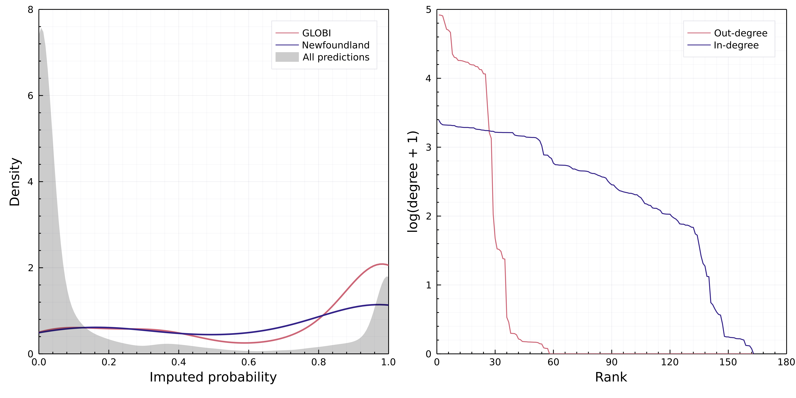

# Introduction

There are two core challenges we are faced with in our understanding of
ecological networks across space, particularly at macro-ecologically relevant
scales [*e.g.* @Trojelsgaard2016EcoNet]. First, networks within a location are
difficult to sample properly [@Jordano2016ChaEcoa; @Jordano2016SamNeta],
resulting in a widespread "Eltonian shortfall" [@Hortal2015SevSho]. This first
challenge (local incompleteness) has been in large part addressed by the recent
multiplication of methods aiming to predict interactions within an *existing*
network, a lot of which are reviewed in @Strydom2021RoaPre. Second, recent
analyses based on collected data [@Poisot2021GloKno] or metadata
[@Cameron2019UneGlo] highlight that ecological networks are currently studied in
a biased subset of space and bioclimates, which impedes our ability to
generalize any local understanding of network structure. Meaning that although
the framework to address local incompleteness exists there are still regions for
which we currently have no feasible means to predict interactions due to a lack
of *local* data. Having a general solution for the issue of metaweb inference
[@Morales-Castilla2015InfBioa] that, despite situations where minimal knowledge
about interactions within a species pool is known, can produce a plausible
metaweb could be the catalyst for significant breakthroughs in our ability to
start thinking about species interactions networks over large spatial scales.

Here, we present a general method for the transfer learning of network
representations, relying on the similarities of species in a biologically
relevant proxy space. This method allows for the prediction of species
interactions based on knowledge extracted from another species pool for which
interactions are known. This allows us to construct a *probabilistic* metaweb
for a community for which we have *no* prior interaction data for that region.
Our method is outlined in @fig:concept; where we provide an illustration based
on learning an embedding of a metaweb of trophic interactions for European
mammals [known interaction; @Maiorano2020TetEu; @Maiorano2020DatTet], and based
on phylogenetic relationships between mammals globally [@Upham2019InfMam],
transfer this representation to the pool of mammals in Canada (no known
interactions in this instance).

![Overview of the phylogenetic transfer learning of species interactions
networks. Starting from an initial network, we learn its representation through
a graph embedding step (here, a truncated Singular Value Decomposition),
yielding a series of latent traits; second, for the destination species pool, we
perform ancestral character estimation using a phylogeny (here, using a Brownian
model for the latent traits); we then sample from the reconstructed distribution
of latent traits to generate a probabilistic metaweb at the destination (here,
assuming a uniform distribution of traits), and threshold it to yield the final
list of interactions.](figures/figure-concept.png){#fig:concept}

There are a plurality of measures of species similarities that can be used for
knowledge transfer [see *e.g.* @Morales-Castilla2015InfBioa]; nevertheless,
phylogenetic proximity has a number of desirable properties when working at
large scales. @Gerhold2015PhyPat make the point that phylogenetic signal
captures diversification of characters (large macro-evolutionary process), but
not necessarily community assembly (fine ecological process); @Dormann2010EvoCli
previously gave very similar conclusions. Interactions tend to conserve
phylogenetic signal that encompasses a wide range of ecological and evolutionary
mechanisms [@Mouquet2012EcoAdv; @Cavender-Bares2009MerCom], and most
importantly, retain this signal even when it is not detectable at the community
scale [@Poisot2018IntRet; @Hutchinson2017CopSig]. Finally, species interactions
at macro-ecological scales seem to respond mostly to macro-evolutionary
processes [@Price2003MacThe]; this is evidenced by the presence of conserved
backbones in food webs [@DallaRiva2016ExpEvo], strong evolutionary signature on
prey choice [@Stouffer2012EvoCona], and strong phylogenetic signature in food
web intervality [@Eklof2016PhyCom]. Taken together, these consideration suggest
that phylogenies can reliably be used to transfer knowledge on species
interactions.

**TK** Results/summary type paragraph

Add definitions of transfer learning [@Torrey2010TraLea]

# Data used for the case study

We use data on the European metaweb assembled by @Maiorano2020TetEu. We use the
definition of the metaweb first introduced by @Dunne2006NetStr, *i.e.* an
inventory of all possible interactions within species from a spatially delimited
pool. The metaweb is not a prediction of the food web at any specific locale
within the frontiers of the species pool -- in fact, these local food webs are
expected to have a subset of both the species and the interactions of their
metaweb [@Poisot2012DisSpea]. This being said, as the metaweb represents the
total of functional, phylogenetic, and macroecological processes
[@Morales-Castilla2015InfBioa], it is still worthy of ecological attention. We
induced the subgraph corresponding to all mammals by matching species names in
the original network first to the GBIF taxonomic backbone
[@GBIFSecretariat2021GbiBac], and retaining all those who matched to mammals;
all nodes had valid matches to GBIF at this step, and so this backbone is used
for all name reconciliation steps as outlined below.

The European metaweb represents the knowledge we want to learn and transfer; the
support for transfer is here represented by the phylogenetic similarity of
mammals. We used the mammalian consensus supertree by @Upham2019InfMam, for
which all approx. 6000 names have been similarly matched to their GBIF valid
names. This step allows us to place each node of the mammalian European metaweb
in the phylogeny.

The destination problem to which we want to transfer knowledge is the trophic
interactions between mammals in Canada. We obtained the list of extant species
from the IUCN checklist, and selected the terrestrial and semi-aquatic species
(this corresponds to the same selection that was applied by @Maiorano2020TetEu
in the European metaweb). The IUCN names were, as previously, reconciled against
GBIF to have an exact match to the taxonomy.

The European metaweb had XXX species, and the Canadian species pool had YYY - of
these, only 17 were shared, which highlights the need to rely on a knowledge
transfer approach. In the following sections, we describe the representational
learning step applied to European data, the transfer step through phylogenetic
similarity, and the generation of a probabilistic metaweb for the destination
species pool.

# Method description

The crux of the method is the transfer of knowledge of a known network, in order
to predict interactions between species from another location. In @fig:concept,
we give a high-level overview of the approach; in the example around which this
manuscript is built (leveraging detailed knowledge about trophic interactions
between Mammalia in Europe to predict the less known trophic interactions
between closely phylogenetically related Mammalia in Canada), we use a series of
specific steps for network embedding, trait inference, and network prediction
and thresholding. This being said, the methods at each step may be substituted
by others when the data support it.

Specifically, our approach can be summarized as follows: from the known network
in Europe, we use a truncated Singular Values Decomposition [t-SVD;
@Halko2011FinStr] to generate latent traits representing a low-dimensional
embedding of the network; these traits give an unbiased estimate of the node's
position in the latent feature spaces. Then, we map these latent traits onto a
reference phylogeny (other distance-based measures of species proximity that
allow for the inference of features in the latent space can be used, such as for
example dissimilarity in functional traits). Based on the reconstructed latent
traits for species in the destination species pool, a Random Dot Product Graph
(RDPG) model predicts the interaction between species through a function of the
nodes' features. Thus, from latent traits and nodes position, we can infer
interactions.

## Implementation and code availability

The entire pipeline is implemented in *Julia* 1.6 [@Bezanson2017JulFre], and is
available under the permissive MIT License at DOI. The taxonomic cleanup steps
are done using `GBIF.jl` [@Dansereau2021SimJl]. The network embedding and
analysis is done using `EcologicalNetworks.jl` [@Banville2021ManJl;
@Poisot2019EcoJl]. The phylogenetic simulations are done using
`PhyloNetworks.jl` [@Solis-Lemus2017PhyPac] and `Phylo.jl` [@Reeve2016HowPar]. A
complete `Project.toml` file specifying the full tree of dependencies is
available alongside the code, at
[`https://osf.io/2zwqm/`](https://osf.io/2zwqm/). This material also includes a
fully annotated copy of the entire code required to run this project; the
pipeline can be executed on a laptop in a matter of minutes, and therefore does
not require extensive computational power.

## Learning the origin network representation

The first step in transfer learning is to learn the structure of the origin
dataset. In order to do so, we rely on an approach inspired from
representational learning, where we learn a *representation* of the metaweb,
rather than a list of interactions. This approach is conceptually different from
other metaweb-scale predictions (*.e.g.* ALBOUY, others?), in that the metaweb
representation is easily transferable. Specifically, we use Random Dot Product
Graphs [RDPG; @Young2007RanDot] to create a number of latent variables that can
be combined into an approximation of the network adjacency matrix. RDPG results
are known to have strong phylogenetic signal, and to capture the evolutionary
backbone of food webs [@DallaRiva2016ExpEvo]. In addition, recent advances show
that the latent variables produced this way can be used to predict *de novo*
network edges [@Runghen2021ExpNod].

The latent variables are created by performing a truncated Singular Value
Decomposition (t-SVD) on the adjacency matrix. SVD is an appropriate embedding
of ecological networks, which has recently been shown to both capture their
complex, emerging properties [@Strydom2021SvdEnt], and to allow highly accurate
prediction of the interactions within a single network [@Poisot2021ImpMam].
Under t-SVD, an adjacency matrix $\mathbf{A}$ (where $\mathbf{A}_{m,n}
\in\mathbb{B}$ where 1 indicates predation and 0 an absence thereof) <!-- might
be a bit on the 'patronising' side to spell out as much --> is decomposed into
three components, so that $\mathbf{A} = \mathbf{L}\mathbf{\Sigma}\mathbf{R}^*$,
for which $\mathbf{\Sigma}$ is an $r\times r$ diagonal matrix (where $r$ is the
rank of matrix $\mathbf{A}$) containing only informative, non-zero singular
($\sigma$) values, $\mathbf{L}$ is an $m \times r$ matrix, and $\mathbf{R}'$ an
$n \times r$ matrix.

The latent variables used for the RDPG, called the left and right subspaces, are
defined as $\mathcal{L} = \mathbf{L}\sqrt{\mathbf{\Sigma}}$, and $\mathcal{R} =
\sqrt{\mathbf{\Sigma}}\mathbf{R}$ -- using the full rank of $\mathbf{A}$,
$\mathcal{L}\mathcal{R}' = \mathbf{A}$, and using any smaller rank results in
$\mathcal{L}\mathcal{R}' \approx \mathbf{A}$. Using a rank of 1 for the t-SVD
provides a first-order approximation of the network, etc.

The specific rank at which the SVD ought to be truncated is a difficult
question. The purpose of SVD is to remove the noise, expressed at high
dimensions, and to focus on the signal, expressed at low dimension. In datasets
with a clear signal/noise demarcation, the scree plot of $\mathbf{\Sigma}$ can
show a sharp drop at the rank where noise starts. Alternatively, REF showed that
the profile likelihood (assuming a known distribution of $\mathbf{\Sigma}$, or a
normal distribution otherwise) peaks at the rank maximizing the signal-to-noise
ratio. Because the European metaweb is almost entirely known, the amount of
noise is low; this is reflected in @fig:scree (left), where the scree plot shows
no important drop, and in @fig:scree (right) where the proportion of variance
explained increases smoothly at higher dimensions. For this reason, we default
back to an arbitrary threshold that explain 60% of the variance in the
underlying data, corresponding to 12 dimensions.

![Left: representation of the screeplot of the eigenvalues from the t-SVD on the
European metaweb. The screeplot shows no obvious drop in the eigenvalues that
may be leveraged to automatically detect a minimal dimension for embedding,
after *e.g.* @Zhu2006AutDim. Right: cumulative fraction of variance explained by
each dimensions up to the rank of the European metaweb. The grey lines
represents cutoff at 40, 60, and 80% of variance explained. For the rest of the
analysis, we reverted to an arbitrary threshold of 60% of variance explained,
which represented a good tradeoff between accuracy and reduced number of
features.](figures/figure-screeplot.png){#fig:scree}

Because RDPG relies on matrix multiplication, the higher dimensions essentially
serve to make specific interactions converge towards 0 or 1; therefore, for
reasonably low ranks, there is no guarantee that the values in the reconstructed
network will be within the unit range. In order to determine what constitutes an
appropriate threshold, we performed the RDPG approach on the European metaweb,
and evaluated the threshold by treating this as a binary classification problem,
specifically assuming that both 0 and 1 in the European metaweb are all true.
Given the methodological given in REF, this seems like a reasonable assumption,
although one that does not hold for all metawebs. We used the thresholding
approach presented in HAYSTACK, and picked a cutoff that maximized Youden's J
statistic [@Youden1950IndRat]; the resulting cutoff was 0.22, and gave an
accuracy above 0.99.

The left and right subspaces for the European metaweb, accompanied by the
threshold, represent the knowledge we seek to transfer. In the next section, we
explain how we rely on phylogenetic similarity to do so.

## Transfer learning through phylogenetic relatedness

In order to transfer the knowledge from the European metaweb to the Canadian
species pool, we performed ancestral character estimation using a Brownian
motion model, which is a conservative approach in the absence of strong
hypotheses about the nature of phylogenetic signal in the network decomposition
[@Litsios2012EffPhy]. We assumed that all traits (*i.e.* the feature vectors for
the left and right subspaces) were independent, which is a reasonable assumption
as every trait/dimension added to the t-SVD has an *additive* effect to the one
before it. The Brownian motion algorithm returns the *average* value of the
trait, and its upper and lower bounds. Because we do not estimate other
parameters of the traits distributions, we considered that every species trait
is represented as a uniform distribution between these bounds. Therefore, the
inferred left and right sub-spaces for the Canadian species pool
($\hat{\mathcal{L}}$ and $\hat{\mathcal{R}}$) have entries that are
distributions, representing the range of values for a given species at a given
dimension.

These objects represent the transferred knowledge, which we can use for
prediction of the Canadian metaweb.

## Probabilistic prediction of the destination network

The phylogenetic reconstruction of $\hat{\mathcal{L}}$ and $\hat{\mathcal{R}}$
has an associated uncertainty, represented by the breadth of the uniform
distribution associated to each of their entries. Therefore, we can use this
information to assemble a *probabilistic* metaweb in the sense of
@Poisot2016StrPro, *i.e.* in which every interaction is represented as a single,
independent, Bernoulli event of probability $p$.

{#fig:subspaces}

Specifically, we have adopted the following approach. For every entry in
$\hat{\mathcal{L}}$ and $\hat{\mathcal{R}}$, we draw a value from its
distribution. This results in one instance of the possible left
($\hat{\mathcal{l}}$) and right ($\hat{\mathcal{r}}$) subspaces for the Canadian
metaweb. These can be multiplied, to produced one matrix of real values. Because
the entries in $\hat{\mathcal{l}}$ and $\hat{\mathcal{r}}$ are in the same space
where $\mathcal{L}$ and $\mathcal{R}$ were originally predicted, it follows that
the threshold $\rho$ estimated for the European metaweb also applies. We use
this information to produce one random Canadian metaweb, $N =
\hat{\mathcal{L}}$$\hat{\mathcal{R}}' \ge \rho$ [@fig:subspaces].

Because the intervals around some trait values can be broad [in fact, probably
broader than what they would actually be, see *e.g.* @Garland1999IntPhy], we
repeat the above process $2\times 10^5$ times, which results in a probabilistic
metaweb $P$, where the probability of an interaction (here conveying our degree
of trust that it exists given the inferred trait distributions) is given by the
number of times where it appears across all random draws $N$, divided by the
number of samples. An interaction with $P_{i,j} = 1$ means that these two
species were predicted to interact in all $2\times 10^5$ random draws, etc..

## Data cleanup, discovery, validation, and thresholding

Once the probabilistic metaweb for Canada has been produced, we followed a
number of data inflation steps to finalize it.

{#fig:inflation}

First, we extracted the subgraph corresponding to the 17 species shared between
the European and Canadian pools, and replaced these interactions with a
probability of 0 (non-interaction) or 1 (interaction). This represents a minute
modification of the inferred network (about 0.8% of all species pairs from the
Canadian web), but ensures that (we?) are directly re-using knowledge from
Europe.

Second, we looked for all species in the Canadian pool known to the Global
Biotic Interactions (GLOBI) database **REF**, and extracted their known
interactions. Because GLOBI aggregates observed interactions, it is not a
*networks* data source, and therefore the only information we can reliably
extract from it is that a species pair *was reported to interact at least once*.
This last statement should yet be taken with caution, as some sources in GLOBI
(*e.g.* **TK**) are produced though text-mining, and therefore do not document
direct evidence of the interaction. Nevertheless, should the predictive model
work, we would expect that a majority of interactions known to GLOBI would also
be predicted. After performing this check, we set the probability of all
interactions known to GLOBI (366 in total, 33 of which were not predicted by the
model, for a success rate of 91%) to 1.

Finally, we downloaded the data from @Strong2014ImpNona, who mined various
literature sources to identify trophic interactions in Newfoundland. This
dataset documented 25 interactions between mammals, only two of which were not
part of our predictions, resulting in a success rate of 92%. These two
interactions were added to our predicted metaweb with a probability of 1.

{#fig:thresholds}

Because the confidence intervals on the inferred trait space are probably
over-estimates, we decided to apply a thresholding step to the interactions
after the data inflation [@fig:thresholds]. @Cirtwill2021BuiFoo highlight a
number of strategies to threshold probabilistic networks. Their methods assume
the underlying data to be tag-based sequencing, which represents interactions as
co-occurrences of predator and prey within the same tags; this is conceptually
identical to our Bernoulli-trial based reconstruction of a probabilistic
network. We performed a full analysis of the effect of various cutoffs, and as
they either resulted in removing too few interactions, or removing enough
interactions that species started to be disconnected from the network, we set
the threshold for a probability equivalent to 0 to the largest possible value
that still allowed all species to have at least one interaction with a non-zero
probability.

# Results and discussion of the case study

**TP** @fig:thresholds -- the cutoffs using maximum curvature of central
difference approximation of the second order partial derivative result in
respectively species being lost, or almost all links being kept -- we settled on
the value that allowed all species to remain.

![Top: biological significance of the first dimension. Left: there is a linear
relatiosnhip between the values on the first dimension of the left subspace and
the generality, *i.e.* the relative number of preys, *sensu*
@Schoener1989FooWeb. Species with a value of 0 in this subspace are at the
bottom-most trophic level. Right: there is, similarly, a linear relationship
between the position of a species on the first dimension of the right subspace
and its vulnerability, *i.e.* the relative number of predators. Taken together,
these two figures show that the first-order representation of this network would
capture its degree distribution. Bottom: topological consequences of the first
dimension. Left: differences in the $z$-score of the actual configuration model
for the reconstructed network, and the prediction based only on the first
dimension. Right: distribution of the differences in the left
panel.](figures/figure-degree.png){#fig:degree}

The t-SVD embedding is able to learn relevant ecological features for the
network. @fig:degree shows that the first rank correlates linearly with
generality and vulnerability [@Schoener1989FooWeb], *i.e.* the number of preys
and predators. Importantly, this implies that a rank 1 approximation represents
the configuration model [@Park2004StaMec] for the metaweb, or (accounting for
the probabilistic nature of the degree) the soft configuration model
[@vanderHoorn2018SpaMax], both of which are maximum entropy graph models
[@Garlaschelli2018CovStr], with respectively sharp and soft local constraints.
The configuration model is widely used by ecologists in the context of null
hypothesis significance testing of network structure [*e.g.*
@Bascompte2003NesAss], and it is noteworthy that for this metaweb, the relevant
information was extracted at the first rank. Because the first rank corresponds
to the leading eigenvalue of the system, the results of @fig:degree have a
straightforward interpretation: degree-based processes are the most important in
structuring the mammalian food web.

# Discussion

As @Herbert1965Dun rightfully pointed out, "[y]ou can't draw neat lines around
planet-wide problems"; in this regard, our approach must contend with two
interesting problems. The first is the limit of the metaweb to embed and
transfer. If the initial metaweb is too narrow in scope, notably from a
taxonomic point of view, the chances of finding another area with enough related
species to make a reliable inference decreases. This is notably true if the
metaweb is assembled in an area with mostly endemic species. Conversely, the
metaweb should be reliably filled, which assumes that the $S^2$ interactions in
a pool of $S$ species have been examined, either through literature surveys or
expert elicitation. The second problem is to determine which area should be used
to infer the new metaweb in, as this determines the species pool that must be
used. In our application, we focused on the mammals of Canada. The upside of
this approach is that information at the country level are likely to be required
by policy makers and stakeholders for their biodiversity assessment; the
downside of this approach is that Canada is a colonial construct with no
relevance to ecological processes.

TK One important aspect in which Europe and Canada differ is the legacy of human
impacts, which have been much longer in Europe. @Nenzen2014Imp850a show that
even at small scales (the Iberian peninsula), mammal food webs retain the signal
of both climate change and human activity, even when this human activity was
orders of magnitude less important than it is now. Similarly, @Yeakel2014ColEco
show that changes in human occupation over several centuries can lead to food
web collapse. Megafauna in particular seems to be very sensitive to human
arrival [@Pires2015PleMeg]. In short, there is well-substantiated support for
the idea that human footprint affects more than the risk of species extinction
[@Marco2018ChaHum], and can lead to changes in interaction structure. Yet,
interactions being inherently more plastic, there have been documented instances
of food webs undergoing rapid collapse/recovery cycles over short periods of
time [@Pedersen2017SigCol]. Embedding a network also, in a sense, embeds its
evolutionary history, especially as RDPG captures ecological signal
[@DallaRiva2016ExpEvo]; at this point, it is important to recall that a metaweb
is intended as a catalogue of all possible interactions, which should then be
filtered [@Morales-Castilla2015InfBioa].

TK @Cirtwill2019QuaFra -- we need an informative interaction-level prior on
probability: this method might be it

<!-- 
TK A cautionary tale regarding validation. Interaction can never be a true
negative. Cannot use a empirical subset of a bigger (predicated) network for
validation -> because e.g. dietary shifts across range.
-->

# References
